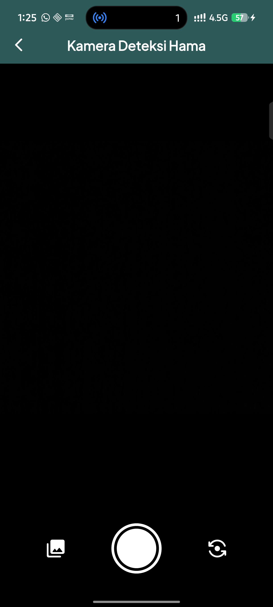

<p align="center">
  
</p>

<h1 align="center">🌶️ CabaiCare</h1>

<p align="center">
  <strong>AI-Powered Chili Pepper Pest Detection Mobile Application</strong><br/>
  Real-time & image-based pest identification using YOLOv8 and TFLite, built with Flutter.
</p>

<p align="center">
  
  
  
  
  
  
</p>

---

## 📖 Table of Contents

- [Overview](#overview)
- [Key Features](#key-features)
- [Screenshots](#screenshots)
- [Architecture](#architecture)
- [Tech Stack](#tech-stack)
- [Project Structure](#project-structure)
- [ML Pipeline](#ml-pipeline)
- [Database Schema](#database-schema)
- [Getting Started](#getting-started)
  - [Prerequisites](#prerequisites)
  - [Installation](#installation)
  - [Running the App](#running-the-app)
  - [Building for Production](#building-for-production)
- [Configuration](#configuration)
- [Detectable Pest Classes](#detectable-pest-classes)
- [Contributing](#contributing)
- [Troubleshooting](#troubleshooting)
- [Acknowledgements](#acknowledgements)
- [License](#license)

---

## Overview

**CabaiCare** is a mobile application designed to assist chili pepper farmers and agricultural stakeholders in identifying common pests that attack chili plants (*Capsicum annuum*). The app leverages a custom-trained **YOLOv8 Nano** object detection model converted to **TensorFlow Lite** for efficient, fully offline inference directly on the user's device — no internet connection required.

The application provides two distinct detection modes:

1. **Image Capture & Gallery Upload** — Snap a photo or pick one from the gallery, then run single-image inference with bounding box visualization and confidence scoring.
2. **Real-Time Video Detection** — Continuous live camera feed with frame-by-frame YOLO inference, rendering bounding boxes in real-time with configurable confidence, IoU, and item thresholds.

Beyond detection, CabaiCare includes a comprehensive **pest encyclopedia** with morphological descriptions, recommended pesticide treatments (both organic and chemical), and academic references sourced from peer-reviewed agricultural journals.

---

## Key Features

| Feature | Description |
|---|---|
| 🎯 **Image Detection** | Capture or upload an image for single-shot pest inference with bounding box overlay |
| 📹 **Real-Time Detection** | Live camera feed with continuous YOLOv8 inference, FPS counter, and adjustable thresholds |
| 🧠 **On-Device ML** | Fully offline inference using TFLite (image mode) and Ultralytics YOLO plugin (real-time mode) |
| 📊 **Detection Results** | Per-class object count, dominant pest label, confidence percentage, and color-coded bounding boxes |
| 💾 **Detection History** | SQLite-backed local storage of all detection results with image, bounding boxes, and timestamps |
| 📚 **Pest Encyclopedia** | Detailed pest profiles including scientific names, morphology, damage symptoms, and control methods |
| 📖 **User Manual** | In-app step-by-step guide with annotated screenshots for every feature |
| ⭐ **Feature Rating** | Local feedback system allowing users to rate individual app features |
| 🎨 **Custom UI** | Glassmorphic floating navbar, branded color palette, custom fonts (Inter, Plus Jakarta Sans, Poppins) |
| 🚀 **Custom Splash Screen** | Branded launch screen with smooth transition to the home dashboard |

---

## Screenshots

> *To add screenshots, place your screen captures in the `assets/images/` directory and reference them here.*

<p align="center">
  
</p>

---

## Architecture

The application follows a **clean layered architecture** pattern separating concerns into distinct layers:

```
┌─────────────────────────────────────────────┐
│                  UI Layer                    │
│  (Screens, Widgets, Navigation)             │
├─────────────────────────────────────────────┤
│              Controller Layer                │
│  (CameraInferenceController)                │
├─────────────────────────────────────────────┤
│               Service Layer                  │
│  (TfliteService — Model Loading & Predict)  │
├─────────────────────────────────────────────┤
│                Data Layer                    │
│  (DatabaseHelper, PestData, ManualData)      │
├─────────────────────────────────────────────┤
│               Model Layer                    │
│  (HistoryModel, PestModel)                  │
├─────────────────────────────────────────────┤
│            Assets / ML Models                │
│  (YOLOv8n TFLite, Labels, Images, Fonts)    │
└─────────────────────────────────────────────┘
```

### Data Flow

```
Camera/Gallery Image
        │
        ▼
  Pre-processing (Resize to 640×640, Normalize RGB)
        │
        ▼
  TFLite Interpreter (YOLOv8n Model)
        │
        ▼
  Raw Output Tensor [1, 7, 8400]
        │
        ▼
  Post-processing (Confidence Thresholding → NMS)
        │
        ▼
  Final Detections (Label, Confidence, BBox)
        │
        ▼
  UI Rendering (Bounding Boxes + Result Card)
        │
        ▼
  SQLite Persistence (Optional Save to History)
```

---

## Tech Stack

### Core Framework
| Technology | Version | Purpose |
|---|---|---|
| Flutter | 3.x | Cross-platform mobile UI framework |
| Dart | ≥ 3.3.0, < 4.0.0 | Programming language |
| Material Design 3 | — | UI components and theming |

### Machine Learning
| Package | Version | Purpose |
|---|---|---|
| `tflite_flutter` | ^0.12.1 | On-device TFLite model inference for image detection |
| `ultralytics_yolo` | ^0.3.4 | Real-time YOLO inference via Ultralytics plugin |

### Camera & Media
| Package | Version | Purpose |
|---|---|---|
| `camera` | ^0.12.0+1 | Camera preview and image capture |
| `image_picker` | ^1.2.1 | Gallery image selection |
| `image` | ^4.8.0 | Image decoding, resizing, and cropping |

### Data & Persistence
| Package | Version | Purpose |
|---|---|---|
| `sqflite` | ^2.3.0 | Local SQLite database for detection history & ratings |
| `shared_preferences` | ^2.5.5 | Key-value local storage |
| `path_provider` | ^2.1.5 | Platform-specific directory paths |
| `path` | ^1.9.1 | File path manipulation |

### UI & Styling
| Package | Version | Purpose |
|---|---|---|
| `google_fonts` | ^8.1.0 | Google Fonts integration |
| `flutter_svg` | ^2.0.10 | SVG rendering |
| `image_network` | ^2.6.0 | Network image loading |
| `persistent_bottom_nav_bar_v2` | ^6.3.2 | Bottom navigation (reference) |
| `flutter_launcher_icons` | ^0.14.4 | Custom app launcher icon generation |
| `flutter_native_splash` | ^2.4.7 | Native splash screen |

### Utilities
| Package | Version | Purpose |
|---|---|---|
| `permission_handler` | ^12.0.1 | Runtime permission management |
| `cupertino_icons` | ^1.0.8 | iOS-style icons |
| `change_app_package_name` | ^1.5.0 | Package name utility |

---

## Project Structure

```
cabaicare/
├── android/                         # Android platform-specific code
│   └── app/
│       └── src/main/
│           └── AndroidManifest.xml   # Permissions & app configuration
├── assets/
│   ├── fonts/                       # Custom font families
│   │   ├── Inter-*.ttf              # Inter (Regular, ExtraLight Italic)
│   │   ├── PlusJakartaSans-*.ttf    # Plus Jakarta Sans (Light, Medium)
│   │   ├── LeagueSpartan-*.ttf      # League Spartan (Light)
│   │   └── Poppins-*.ttf            # Poppins (Light, Medium)
│   ├── icons/                       # Custom SVG/PNG icons
│   ├── images/                      # App images, pest photos, screenshots
│   │   └── cabaicare.png            # App logo
│   └── models/
│       ├── yolov8n_train5.tflite    # Custom-trained YOLOv8 Nano model (~6MB)
│       └── labels.txt               # Class labels (3 pest classes)
├── lib/
│   ├── main.dart                    # App entry point, model & camera init
│   ├── controllers/
│   │   └── camera_inference_controller.dart  # Real-time YOLO camera controller
│   ├── data/
│   │   ├── database_helper.dart     # SQLite DB singleton (history + ratings)
│   │   ├── manual_data.dart         # In-app user manual content
│   │   └── pest_data.dart           # Pest encyclopedia static data
│   ├── models/
│   │   ├── history_model.dart       # Detection history data model
│   │   └── pest_model.dart          # Pest information data model
│   ├── screens/
│   │   ├── about_screen.dart        # About/info screen
│   │   ├── camera_inference_screen.dart  # Real-time YOLO detection screen
│   │   ├── chili_detail_screen.dart # Chili commodity information
│   │   ├── detector_screen.dart     # Image capture/upload detection
│   │   ├── history_detail_screen.dart   # Individual history record detail
│   │   ├── history_list_screen.dart # Detection history list
│   │   ├── home_page.dart           # Main dashboard with floating navbar
│   │   ├── manual_screen.dart       # User manual/guide
│   │   ├── pest_detail_screen.dart  # Individual pest profile detail
│   │   ├── rating_screen.dart       # Feature rating & feedback
│   │   ├── result_screen.dart       # Detection result with bounding boxes
│   │   └── splash_screen.dart       # Custom splash/launch screen
│   ├── services/
│   │   └── tflite_service.dart      # TFLite model loading, inference & NMS
│   └── widgets/
│       ├── appbar_widget.dart       # Reusable custom app bar
│       ├── camera_controls.dart     # Camera zoom & flip controls
│       ├── camera_inference_content.dart  # YOLO camera view widget
│       ├── camera_inference_overlay.dart  # Detection stats overlay
│       ├── camera_logo_overlay.dart # Branding overlay on camera
│       ├── chili_card.dart          # Chili info card widget
│       ├── control_button.dart      # Generic control button
│       ├── detection_banner.dart    # Dashboard detection CTA banner
│       ├── detection_stats_display.dart  # Stats display widget
│       ├── glass_navbar.dart        # Glassmorphic navigation bar
│       ├── header_section.dart      # Dashboard header section
│       ├── history_item_card.dart   # History list item card
│       ├── model_selector.dart      # ML model selection dropdown
│       ├── pest_column_section.dart # Pest info column layout
│       ├── pest_grid_section.dart   # Pest grid layout (variant 1)
│       ├── pest_grid_section2.dart  # Pest grid layout (variant 2)
│       ├── threshold_pill.dart      # Threshold indicator pill
│       └── threshold_slider.dart    # Confidence/IoU threshold slider
├── test/                            # Unit & widget tests
├── pubspec.yaml                     # Dependencies & asset declarations
├── pubspec.lock                     # Locked dependency versions
├── analysis_options.yaml            # Dart analyzer configuration
└── README.md                        # This file
```

---

## ML Pipeline

### Model Details

| Property | Value |
|---|---|
| Architecture | YOLOv8 Nano (Ultralytics) |
| Model File | `yolov8n_train5.tflite` |
| Model Size | ~6 MB |
| Input Shape | `[1, 640, 640, 3]` (RGB, normalized 0.0–1.0) |
| Output Shape | `[1, 7, 8400]` (4 bbox coords + 3 class scores × 8400 anchors) |
| Classes | 3 (Aphids, Whiteflies, Thrips) |
| Quantization | Float32 |

### Inference Modes

#### 1. Image Detection (`TfliteService`)
- Loads `.tflite` model via `tflite_flutter` package.
- Pre-processes: decode → resize to 640×640 → normalize RGB to [0, 1].
- Runs interpreter → parses `[1, 7, 8400]` output tensor.
- Applies confidence threshold (default: `0.45`) and per-class scoring.
- Runs **Non-Maximum Suppression (NMS)** with IoU threshold `0.45` to eliminate duplicate boxes.
- Returns list of detections: `{ label, confidence, x, y, w, h }`.

#### 2. Real-Time Detection (`ultralytics_yolo`)
- Uses the Ultralytics YOLO Flutter plugin for native, frame-by-frame inference.
- Renders custom bounding boxes with color-coded pest labels.
- Provides adjustable sliders for:
  - **Confidence Threshold** — Minimum detection confidence.
  - **IoU Threshold** — NMS overlap tolerance.
  - **Max Items** — Maximum detections per frame.
- Displays live FPS, model name, and detection count.

### Post-Processing: Non-Maximum Suppression (NMS)

```
Input: Raw detections sorted by confidence (descending)
  │
  ├─ Take highest-confidence box → add to results
  │
  ├─ Remove all remaining boxes with IoU > 0.45
  │   relative to the selected box
  │
  └─ Repeat until no detections remain
  
Output: Filtered, non-overlapping final detections
```

**IoU Formula:**

```
IoU = Area of Overlap / Area of Union
```

---

## Database Schema

CabaiCare uses **SQLite** (via `sqflite`) with the following schema (DB Version: **5**):

### Table: `history`

| Column | Type | Constraints | Description |
|---|---|---|---|
| `ID` | `INTEGER` | `PRIMARY KEY AUTOINCREMENT` | Unique record identifier |
| `image_path` | `TEXT` | `NOT NULL` | Absolute path to captured/selected image |
| `detected_class` | `TEXT` | `NOT NULL` | Dominant detected pest class label |
| `confidence_score` | `TEXT` | `NOT NULL` | Highest confidence score (percentage string) |
| `detected_at` | `TEXT` | `NOT NULL` | ISO 8601 timestamp of detection |
| `bounding_boxes` | `TEXT` | `NULLABLE` | JSON-encoded array of all detection bounding boxes |

### Table: `ratings`

| Column | Type | Constraints | Description |
|---|---|---|---|
| `id` | `INTEGER` | `PRIMARY KEY AUTOINCREMENT` | Unique rating identifier |
| `featureName` | `TEXT` | `NOT NULL` | Name of the rated feature |
| `stars` | `REAL` | `NOT NULL` | Star rating value (e.g., 1.0–5.0) |
| `comment` | `TEXT` | `NULLABLE` | User feedback comment |
| `createdAt` | `TEXT` | `NOT NULL` | ISO 8601 timestamp of rating submission |

### Migration Strategy

The app supports progressive schema migration via `onUpgrade`:
- **v4 → v5**: Adds `ratings` table for local feature feedback storage.
- **v3 → v4**: Adds `bounding_boxes` column to `history` table.

---

## Getting Started

### Prerequisites

Ensure you have the following installed:

| Requirement | Minimum Version | Verify Command |
|---|---|---|
| Flutter SDK | 3.x (Dart ≥ 3.3.0) | `flutter --version` |
| Android Studio | Latest stable | — |
| Android SDK | API 21+ (Lollipop) | — |
| Java JDK | 17 | `java --version` |
| Git | Any | `git --version` |

> **Note:** This app is currently Android-only. iOS support is not configured.

### Installation

1. **Clone the repository:**

   ```bash
   git clone https://github.com/yourusername/cabaicare.git
   cd cabaicare
   ```

2. **Install dependencies:**

   ```bash
   flutter pub get
   ```

3. **Generate launcher icons** (optional, if modifying the icon):

   ```bash
   dart run flutter_launcher_icons
   ```

4. **Generate native splash screen** (optional, if modifying splash):

   ```bash
   dart run flutter_native_splash:create
   ```

### Running the App

1. **Connect a physical Android device** (recommended for camera/ML features) or start an emulator.

2. **Run the app in debug mode:**

   ```bash
   flutter run
   ```

3. **Run with verbose logging** (to see ML inference times):

   ```bash
   flutter run --verbose
   ```

> ⚠️ **Important:** Camera and real-time detection features require a **physical device**. Emulators may not support camera access or may have degraded ML performance.

### Building for Production

```bash
# Build APK
flutter build apk --release

# Build App Bundle (for Play Store)
flutter build appbundle --release
```

The output APK will be located at:
```
build/app/outputs/flutter-apk/app-release.apk
```

---

## Configuration

### Confidence Threshold

The default confidence threshold for image detection is `0.45` (45%). To modify this, update the threshold value in:

```dart
// lib/services/tflite_service.dart — Line 69
double threshold = 0.45;
```

### NMS IoU Threshold

The default IoU threshold for Non-Maximum Suppression is `0.45`. To adjust:

```dart
// lib/services/tflite_service.dart — Line 139
return _calculateIoU(best, item) > 0.45;
```

### Theme Colors

The app's primary brand color is `#2E5959` (deep teal green). The background color is `#F5F9F5`. These are defined in:

```dart
// lib/main.dart
primaryColor: const Color(0xFF2E5959),
scaffoldBackgroundColor: const Color(0xFFF5F9F5),
```

### Custom Fonts

The app uses four custom font families loaded from local assets:

| Font | Weight(s) | Usage |
|---|---|---|
| Inter | 400 (Regular), 200 (ExtraLight Italic) | Primary body text |
| Plus Jakarta Sans | 300 (Light), 500 (Medium) | Headers and titles |
| League Spartan | 300 (Light) | Decorative text |
| Poppins | 300 (Light), 500 (Medium) | Secondary text |

---

## Detectable Pest Classes

| # | Pest Name | Scientific Name | Bounding Box Color | Description |
|---|---|---|---|---|
| 1 | **Aphids** (Kutu Daun) | *Aphis gossypii* | 🟣 Purple | Sap-sucking insects causing leaf curl, stunted growth; vector for mosaic and leaf curl viruses. Crop loss can exceed 90%. |
| 2 | **Whiteflies** (Kutu Kebul) | *Bemisia tabaci* | 🔴 Red | Small white-powdery insects causing chlorosis; vector for Pepper Yellow Leaf Curl Virus (PYLCV/Begomovirus). |
| 3 | **Thrips** | *Thrips parvispinus* | 🔵 Blue | Tiny slender insects causing silvery leaf patches and flower drop; vector for Tobacco Streak Virus (TSV). Up to 23% crop loss. |

Additionally, the pest encyclopedia includes supplementary data on **Anthracnose** (*Colletotrichum* spp.), a fungal disease aggravated by pest-inflicted mechanical wounds.

---

## Contributing

Contributions are welcome! Please follow these steps:

1. **Fork** the repository.
2. **Create a feature branch:**
   ```bash
   git checkout -b feature/your-feature-name
   ```
3. **Commit your changes** with clear, descriptive messages:
   ```bash
   git commit -m "feat: add new pest class detection for mealybugs"
   ```
4. **Push** to your fork:
   ```bash
   git push origin feature/your-feature-name
   ```
5. **Open a Pull Request** with a detailed description of changes.

### Commit Convention

This project follows [Conventional Commits](https://www.conventionalcommits.org/):

| Prefix | Purpose |
|---|---|
| `feat:` | New feature |
| `fix:` | Bug fix |
| `docs:` | Documentation changes |
| `style:` | Code formatting (no logic change) |
| `refactor:` | Code restructuring |
| `perf:` | Performance improvement |
| `test:` | Adding or updating tests |
| `chore:` | Build/tooling changes |

---

## Troubleshooting

### Common Issues

<details>
<summary><strong>Camera not initializing</strong></summary>

- Ensure camera permissions are granted in device settings.
- Verify the device has available cameras: check `availableCameras()` output in logs.
- On emulators, camera features may not work. Use a physical device.

</details>

<details>
<summary><strong>Model fails to load</strong></summary>

- Ensure `assets/models/yolov8n_train5.tflite` exists and is declared in `pubspec.yaml`.
- Check that `assets/models/labels.txt` contains exactly 3 lines (one per class).
- Look for `❌ Gagal memuat model` in debug console for detailed error messages.

</details>

<details>
<summary><strong>Black screen on app launch (Android 12+)</strong></summary>

- The native splash screen is configured for Android 12+ with `android_12` color `#E9EFEF`.
- Regenerate splash: `dart run flutter_native_splash:create`.

</details>

<details>
<summary><strong>Database migration errors</strong></summary>

- If upgrading from an older version, the `onUpgrade` handler manages schema changes automatically.
- For a fresh start, uninstall the app and reinstall to recreate the database from scratch.

</details>

<details>
<summary><strong>Build fails with NDK / TFLite errors</strong></summary>

- Ensure Android NDK is installed via Android Studio → SDK Manager → SDK Tools.
- The `tflite_flutter` package requires CMake and NDK. Follow the [tflite_flutter setup guide](https://pub.dev/packages/tflite_flutter).

</details>

---

## Acknowledgements

- **[Ultralytics](https://ultralytics.com/)** — YOLOv8 object detection framework.
- **[TensorFlow Lite](https://www.tensorflow.org/lite)** — On-device machine learning runtime.
- **[Flutter](https://flutter.dev/)** — Cross-platform UI toolkit by Google.
- **Agricultural Research References:**
  - Sitorus, R. H., & Wilyus. *Pengelolaan Hama Terpadu (PHT) Kutu Kebul, Kutu Daun (Aphids) dan Thrips pada Tanaman Cabai Keriting.* Jurnal Media Pertanian (Jagro), 2023.
  - Rahman, T., Roff, M. N. M., & Ghani, I. B. A. *Within-field distribution of Aphis gossypii and aphidophagous lady beetles in chili.* Entomologia Experimentalis et Applicata, 2010.
  - Hasbulloh, M. I., Nirwanto, H., & Rahmadhini, N. *Pendekatan Geostatistik Untuk Memetakan Sebaran Hama Kutu Kebul Pada Lahan Tanaman Melon.* Jurnal HPT, 2025.
  - Rahmawati, S., Pramudi, M. I., & Liestiany, E. *Pengaruh pemberian pestisida nabati daun bintaro terhadap penyakit antraknosa tanaman cabai.* Jurnal Proteksi Tanaman Tropika, 2024.

---

## License

This project is licensed under the **AGPL-3.0 License**. See the [LICENSE](LICENSE) file for details.

The YOLOv8 components are subject to the [Ultralytics AGPL-3.0 License](https://ultralytics.com/license).

---

<p align="center">
  Built with ❤️ for Indonesian chili farmers<br/>
  <strong>CabaiCare</strong> — Protecting crops, one detection at a time.
</p>
